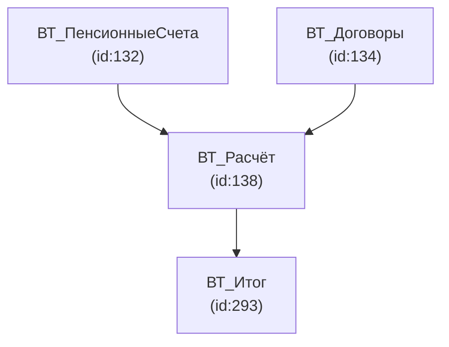
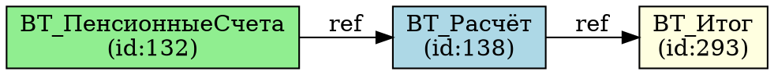

# Форматы для визуализации

Файлы для отрисовки графа зависимостей, дерева ВТ и схем запроса.

---

## Mermaid — `query_graph.mmd`

**Назначение:** быстрая встраиваемая диаграмма в Markdown, GitHub README, Confluence.

**Структура:**


**Особенности:** работает прямо в GitHub без дополнительных инструментов. Ограничен по масштабу (до ~50 узлов).

---

## Graphviz DOT — `query_graph.dot`

**Назначение:** построение детальных графов с настройкой стилей, экспорт в PNG/SVG/PDF.

**Структура:**


**Генерация PNG:** `dot -Tpng query_graph.dot -o query_graph.png`

---

## GEXF — `query_graph.gexf`

**Назначение:** формат для Gephi — инструмента визуального анализа больших графов (>100 узлов).

**Структура:**
```xml
<?xml version="1.0" encoding="UTF-8"?>
<gexf xmlns="http://gexf.net/1.3">
  <graph defaultedgetype="directed">
    <nodes>
      <node id="132" label="ВТ_ПенсионныеСчета"/>
    </nodes>
    <edges>
      <edge id="0" source="132" target="138"/>
    </edges>
  </graph>
</gexf>
```

---

## GraphML — `query_graph.graphml`

**Назначение:** универсальный XML-формат графов для обмена между инструментами (yEd, Gephi, NetworkX).

**Структура:**
```xml
<?xml version="1.0" encoding="UTF-8"?>
<graphml xmlns="http://graphml.graphdrawing.org/graphml">
  <key id="name" for="node" attr.name="name" attr.type="string"/>
  <key id="type" for="node" attr.name="type" attr.type="string"/>
  <graph id="QueryGraph" edgedefault="directed">
    <node id="132">
      <data key="name">ВТ_ПенсионныеСчета</data>
      <data key="type">tempquery</data>
    </node>
    <edge id="e1" source="132" target="138"/>
  </graph>
</graphml>
```

---

## Cytoscape JSON — `cytoscape.json`

**Назначение:** web-визуализация графов с помощью библиотеки Cytoscape.js.

**Структура:**
```json
{
  "elements": {
    "nodes": [
      {"data": {"id": "132", "label": "ВТ_ПенсионныеСчета", "type": "tempquery"}}
    ],
    "edges": [
      {"data": {"id": "e1", "source": "132", "target": "138", "label": "ref"}}
    ]
  }
}
```

---

## D3 JSON — `d3_graph.json`

**Назначение:** кастомная интерактивная визуализация в браузере с помощью D3.js.

**Структура:**
```json
{
  "nodes": [
    {"id": 132, "name": "ВТ_ПенсионныеСчета", "type": "tempquery", "group": 1}
  ],
  "links": [
    {"source": 132, "target": 138, "value": 1}
  ]
}
```

---

## SVG — `query_graph.svg`

**Назначение:** векторный экспорт для документации, отчётов, публикаций. Масштабируется без потери качества.

**Генерация:** `dot -Tsvg query_graph.dot -o query_graph.svg`

---

## PNG — `query_graph.png`

**Назначение:** быстрый просмотр и вставка в отчёты. Не масштабируется.

**Генерация:** `dot -Tpng query_graph.dot -o query_graph.png`

---

## Сравнение форматов визуализации

| Формат | Масштаб | Интерактивность | Инструмент | Рекомендация |
|---|---|---|---|---|
| Mermaid | до 50 узлов | Нет | GitHub/Confluence | Быстрый обзор |
| DOT/SVG | до 200 узлов | Нет | Graphviz | Документация |
| GEXF | 1000+ узлов | Да | Gephi | Глубокий анализ |
| GraphML | 1000+ узлов | Да | yEd, NetworkX | Экспорт/обмен |
| Cytoscape JSON | до 500 узлов | Да | Браузер | Web-отчёт |
| D3 JSON | до 500 узлов | Да | Браузер | Кастомный UI |
